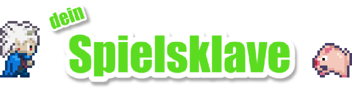

# Spielsklave - You decide what I will develop next!

**Klicke [HIER](README.md) für die Deutsche Version.**

Spielsklave (*lit. "game slave"*) is a German [video series on YouTube](https://www.youtube.com/playlist?list=PL1td_Fr5vMGNqmdJOfnxDPKo_nO87Rs47).
The audience can decide how I will further develop this game by participating in surveys.

## The Game

You can play the game in its current state [here](https://letsgamedev.github.io/spielsklave/)!

## You can support me!
These are some ways to support me if you like this project:

- **[Patreon](https://www.patreon.com/letsgamedev)**: Support me with a small monthly subscription.  
- **[Twitter](https://twitter.com/letsgamedev)**: Follow me on Twitter (if you speak German) or share this project with the hashtag **[#spielsklave](https://twitter.com/hashtag/spielsklave)**.
- **[GitHub](https://github.com/letsgamedev/spielsklave)**: :eye: and :star: this project!

Have fun playing the game!

*Tom*
